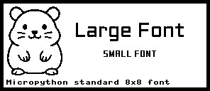

# WeAct-2.9-EPD-Esp32-MPY
Example configuration of [Peter Hinch's nano-gui](https://github.com/peterhinch/micropython-nano-gui) for the WeAct Studio 2.9' Black and White E-Paper-Display for Esp32 using Micropython.

Setup:
1. Download all files (except the `/doc` folder) and upload them to the root of your Micropython device.
2. Adjust the Pin configuration in `color_setup.py` to match your display.
3. Run `main.py`.

The result should look like that:

